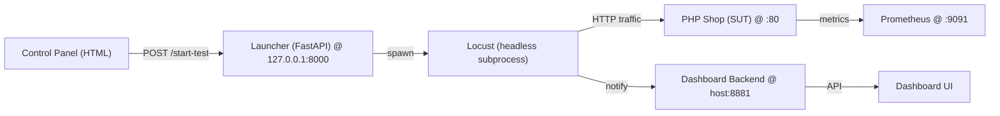

# Enterprise Digital Infrastructure — NEXUS

Overview
--------
NEXUS is an opinionated, educational infrastructure project that demonstrates
an end-to-end observability and load-testing workflow for a small PHP-based
shop. It bundles three complementary pieces:

- A small PHP web application that represents the System Under Test (SUT).
- A Python-based dashboard and metrics pipeline (Prometheus + a lightweight
  backend) for collecting and displaying test-time signals.
- A local load generator built with Locust and a tiny FastAPI launcher that
  lets you orchestrate scenarios from a browser control panel.

The repository is arranged so you can run the pieces independently on a
laptop or together in Docker on a single host (or on a Raspberry Pi for edge
experiments).

Project layout
--------------
- `load-generator/` — Locust scenarios, a simple HTML control panel and a
  FastAPI launcher (`launcher/`) that spawns headless Locust runs and streams
  logs back to the UI.
- `server-py/` — A small Python dashboard backend, Prometheus config, and
  optional Docker Compose setup for running the demo stack.

Goals and use-cases
-------------------
- Provide a compact example for teaching load-testing concepts (ramp shapes,
  spike vs sustained load, write-heavy vs read-heavy scenarios).
- Demonstrate an observability-first setup: how to correlate load tests with
  metrics and dashboard state.
- Offer a lightweight, reproducible playground you can run locally or on a
  small device (Raspberry Pi).

Architecture (logical)
----------------------



Key points:
- The control panel in `load-generator/` talks to the local FastAPI launcher
  (default `127.0.0.1:8000`). The launcher spawns headless Locust subprocesses
  and exposes `/start-test`, `/stop-test` and `/status` for polling.
- The dashboard backend listens on container port `8081` (mapped to host
  `8881` in the provided `docker-compose.yml`). The launcher posts a best-effort
  scenario notification to the dashboard to help the UI show the active test.

Quick start — prerequisites
---------------------------
- Python 3.9+ (3.10 recommended)
- `pip` and an optional virtual environment tool (`venv`, `virtualenv`)
- Docker & Docker Compose (if you want to run the demo stack via containers)

Running the demo stack with Docker Compose
-----------------------------------------
(Recommended for a single-command reproducible run.)

1. Change into the `server-py` directory:

```bash
cd server-py
```

2. Build and start the stack:

```bash
docker-compose up --build
```

Compose maps the dashboard container's internal port `8081` to host port
`8881` so you can access the API at `http://localhost:8881` (or
`http://<pi-ip>:8881` on a Pi).

Running the load generator locally (no containers)
-------------------------------------------------
1. Create and activate a virtual environment (optional but recommended):

```bash
python -m venv .venv
# Windows
.\.venv\Scripts\activate
# macOS / Linux
source .venv/bin/activate
```

2. Install dependencies:

```bash
pip install -r load-generator/requirements.txt
```

3. Start the FastAPI launcher (binds to `127.0.0.1:8000` by default):

```bash
cd load-generator
uvicorn launcher.main:app --host 127.0.0.1 --port 8000 --reload
```

4. Open the control panel: open the file
`load-generator/control_panel.html` in your browser (you can open it with
`file://` or serve it from a tiny static server). The control panel polls the
launcher at `http://127.0.0.1:8000/status` and uses `/start-test` and
`/stop-test` to manage runs.

Running Locust directly (CLI)
----------------------------
You can bypass the launcher and run Locust from the `load-generator/locust/`
context. Examples:

```bash
# From load-generator/locust/
locust -f scenarios/normal.py         --headless -u 100  -r 10  -t 120s --host http://localhost
locust -f scenarios/flash_crowd.py    --headless -u 2000 -r 200 -t 120s --host http://localhost
locust -f scenarios/ddos.py           --headless -u 1500 -r 300 -t  90s --host http://localhost
locust -f scenarios/checkout_storm.py --headless -u 500  -r 50  -t 120s --host http://localhost
locust -f scenarios/degradation.py    --headless -u 300  -r 20  -t 180s --host http://localhost
locust -f scenarios/saturation.py     --headless -u 5000 -r 500 -t 120s --host http://localhost
```

Notes:
- Locust's web UI (if you run it non-headless) listens on port `8089` by
  default. When using the FastAPI launcher the tests are spawned headless by
  design so the launcher can manage the subprocess and stream logs.

Ports summary
-------------
- `80`   — PHP shop (SUT) default when served under Apache/nginx.
- `8000` — FastAPI launcher (binds to `127.0.0.1:8000` for the control panel).
- `8081` — Dashboard backend container port (what the backend process binds
  to inside the container).
- `8881` — Dashboard backend host port (compose maps `8881:8081` for local
  convenience; the launcher posts to this host port).
- `9091` — Prometheus scrape/target port (in the demo compose).
- `8089` — Locust web UI (default when running Locust with the UI enabled).

Environment variables
---------------------
- `LOCUST_TARGET_HOST` — default target host for Locust runs when requests to
  the launcher omit a `host` field (example: `http://localhost`).
- `NEXUS_BIND_PORT` — upstream bind port used by the Python dashboard server
  (default `8081` inside the container).

Developer notes
---------------
- The `load-generator/launcher/runner.py` file spawns Locust as a subprocess
  using `sys.executable -m locust` to avoid PATH/venv ambiguity and captures
  stdout/stderr into a bounded ring buffer for the control panel to display.
- Scenario notifications are posted as best-effort to the dashboard
  backend. The launcher attempts two endpoints for resilience: the standalone
  Python backend at host `:8881` and the legacy PHP `/api/scenario` shim.

Translations and housekeeping
-----------------------------
- All code comments in the `load-generator` component are in English and aimed
  at being clear to contributors and maintainers.

Contributing
------------
Contributions are welcome. Suggested workflow:

1. Fork the repository.
2. Create a feature branch.
3. Open a pull request with a clear description of changes and motivation.

License
-------
This project is provided for educational purposes. Please check the
`LICENSE` file in the repository root (if present) or contact the project
maintainers for licensing details.


---
If you want, I can now:
- Run a quick static lint on the Python files.
- Start the launcher locally and demonstrate starting a scenario.
- Add small unit tests for the launcher runner logic.

Tell me which you'd like next.
